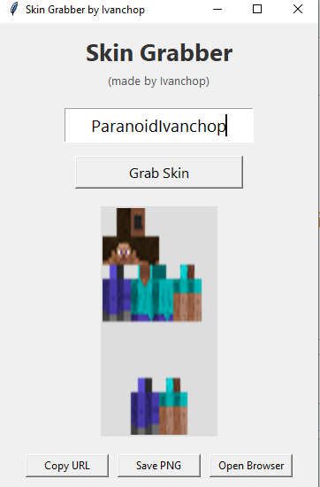

# 🧍 Minecraft Skin Grabber GUI
**Made by Ivanchop**

Skin Grabber is a simple and stylish desktop app that lets you preview and download Minecraft skins by username. It features a clean GUI built with Python and Tkinter.

---

## 🖼️ Preview

---

## ✨ Features

- ✅ Enter any Minecraft username to fetch their current skin
- 🖼️ Instant skin preview in-app
- 📁 Automatically saves skins in a `skins/` folder
- 🔗 Copy direct skin URL to clipboard
- 🌐 Open skin in browser
- 💾 Save as `.png` manually if needed
